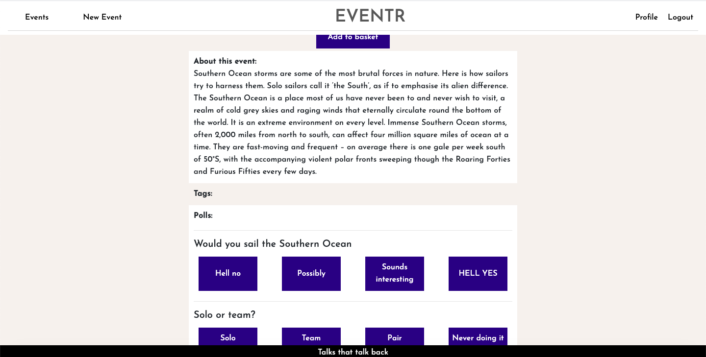

# General Assembly Project 3: eventr

### Overview
eventr - an event organisation and hosting application. Through eventr it is possible to add tickets for events to your basket, and answer polls and post comments for that talk. Created the full-stack application in 8 days as a group project with two other people using a React front-end and Python and Django for the back-end.

### Brief
* Build a full-stack application by making your own backend and your own front-end
* Use a Python Django API using Django REST Framework to serve your data from a Postgres database.
* Consume your API with a separate front-end built with React
* Be a complete product which most likely means multiple relationships and CRUD functionality for at least a couple of models.
* Implement thoughtful user stories/wireframes that are significant enough to help you know which features are core MVP and which you can cut.
* Have a visually impressive design.
* Be deployed online so it's publicly accessible.
* React Hooks is optional for this project

### Timescale
8 days

### Team Mates
Assia Deramchi (https://github.com/A-Der)
Krissy Little (https://github.com/KL-dotcom)

### Technologies
- React.js Hooks
- React.js
- Python
- Django
- PostgreSQL
- JavaScript(ES6) / HTML5
- SCSS
- Yarn package manager
- Axios
- Json Web Tokens
- Git
- GitHub
- Heroku

### Deployment
The application is deployed on Heroku and can be found at https://eventr-ga.herokuapp.com/

### Approach
At first we considerd building a polling app but chose to develop the concept further to include the events themselves with polls and user comments, as well as functionality for logging in, putting tickets in a basket and using a third-party API to put a VR code on the ticket.

Due to the complexity of the back-end structure, all three team members discussed and agreed this prior to constructing the back-end models and completing the wireframes. We divided the team so that Krissy and Assia focused on the back-end and I on the front-end. This enable me to focus on getting the structure of the pages built as per the wireframes we had designed. The front-end utilised both React and React Hooks.

### User Experience
Our goal was to create a clean and modern feel and to keep the user interface as simple to use as possible. To that end, we created a landing page which takes users to the event index page.

On the event index page, we included options to filter the talks by a number of fields, including location, category, price and by free text search. To ensure the user can always see the full list of filtering options, I included a seperate scroll feature for the div. Once the user has chosen which talk they are interested in, to see more information we ask them to log in.

Once a user is logged in, they can see further detail about the talk, including the information about the event and any event tags which have been added. The user can then click the 'Add to basket', which adds the talks to the basket on their profile. 

If the user then goes to the basket section of their profile, they can see the talks in their basket and also go to check out. This moves the event into their Tickets section and also creates a VR code on their ticket using a third party API. 

For all events that the user is attending, they are able to see any polls which have been asked of the attendees, as well as answer them and see how the rest of the audience has voted, and leave comments too for the presenter.

### Bugs and Challenges
The main bug I encountered was getting the filtering and searching fields to work together, so the user narrows down the list of events with each added filter rather than conducting a new filter each time.

### Wins
As the team chose to work together again after Project 3, a big win was the same level of clear, positive, open and collaborative communication we had on Project 3.

On the build, the big win came from getting the filtering of the event index page working as intended!

### Future Content
The one aspect I would like to add in the future is the able to host live streaming of presenters.

